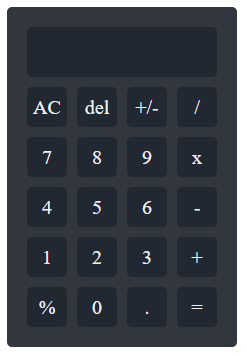

# Simple Calculator

This is a simple calculator project built using HTML, CSS, and JavaScript. The calculator can perform basic mathematical operations such as addition, subtraction, multiplication, and division. Additionally, it includes several additional features like deleting the last character, clearing the output, calculating percentages, and changing positive/negative signs.

## How to Use

1. Open `index.html` in your web browser.
2. Use your mouse to click the buttons on the calculator or use your keyboard to type numbers and mathematical operations. Here's the list of calculator buttons:
   - Number buttons: 0, 1, 2, 3, 4, 5, 6, 7, 8, 9
   - Operation buttons: +, -, *, /
   - Additional buttons: AC (Clear), Del (Delete), +/- (Change sign), % (Percentage), . (Decimal), = (Equals)
   - You can also use keyboard buttons according to the calculator layout.
3. After inputting the mathematical expression, click the "=" button or press the "Enter" key to see the result.

## Features

- Addition (`+`): Adds two or more numbers.
- Subtraction (`-`): Subtracts one number from another.
- Multiplication (`*`): Multiplies two or more numbers.
- Division (`/`): Divides one number by another.
- Delete (`Del`): Deletes the last character from the expression.
- Clear (`AC`): Clears the entire expression.
- Percentage (`%`): Converts a number into a percentage.
- Change Sign (`+/-`): Changes the positive/negative sign of a number.
- Decimal (`.`): Adds a decimal point to a number.
- Evaluate Expression (`=`): Computes the result of the input mathematical expression.

## Contribution

Contributions to the development of this project are highly welcomed. If you'd like to contribute, please create a pull request and we'll review it.

## License

This project is licensed under the [MIT License](LICENSE).
